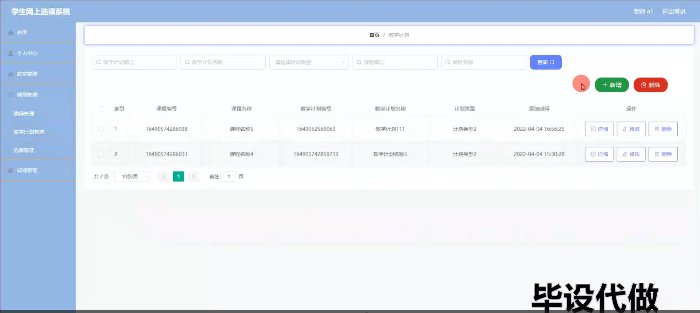

# 毕业设计选题-学生网上选课系统的设计与实现-完成毕业论文

#### 介绍

学生网上选课系统是一款基于Spring Boot开发的教育管理平台，旨在为高校提供高效便捷的选课管理服务。该系统涵盖管理端、学生端和老师端三种角色，分别满足学校管理员、学生和教师的不同需求。系统通过信息化手段，实现了课程安排、选课操作、成绩管理等功能，优化了选课流程，提高了教学管理效率。

#### 研究背景

二十一世纪互联网的出现，改变了几千年以来人们的生活，不仅仅是生活物资的丰富，还有精神层次的丰富。在互联网诞生之前，地域位置往往是人们思想上不可跨域的鸿沟，信息的传播速度极慢，信息处理的速度和要求还是通过人们骑马或者是信鸽传递，这些信息传递都是不可控制的，中间很有可能丢失，信息的传递水平决定了人们生活的水平。如今大家都在使用互联网软件产品，从内部管理设置计算机管理，提高内部信息化的管理水准，从外部市场也可以用计算机获取相关数据进行处理，如今各行各业已经严重依赖于计算机了。
本课题研究和开发学生网上选课系统，让安装在计算机上的该系统变成管理人员的小帮手，提高学生选课信息处理速度，规范学生选课信息处理流程，让管理人员的产出效益更高。

#### 技术栈

后端技术栈：Springboot+Mysql+Maven

前端技术栈：Vue+Html+Css+Javascript+ElementUI

开发工具：Idea+Vscode+Navicate

#### 系统功能介绍

管理端功能模块  
个人中心：管理员可以查看和更新个人信息，管理个人账户和密码，保障账户安全。  
基础数据管理：  
班级管理：管理员可以添加、删除和更新班级信息，确保班级数据的完整和准确。  
计划类型管理：管理员可以管理不同类型的教学计划，确保计划类型信息的正确。  
课程性质管理：管理员可以管理课程的性质分类，如必修、选修等，便于课程管理和统计。  
院系管理：管理员可以管理院系信息，确保院系数据的准确和全面。  
教学资源管理：  
教室管理：管理员可以管理教室资源，包括教室的分配和使用情况，确保教学资源的有效利用。  
老师管理：管理员可以管理教师信息，包括教师的基本信息和授课情况，便于教学资源的合理配置。  
课程管理：  
课程管理：管理员可以管理课程信息，包括课程的添加、删除和更新，确保课程数据的准确性。  
教学计划管理：管理员可以制定和管理教学计划，确保教学计划的合理性和可行性。  
选课管理：管理员可以管理学生的选课情况，包括选课的审核和统计，确保选课过程的规范和有序。  
成绩管理：管理员可以管理学生的成绩信息，包括成绩的录入和查询，确保成绩数据的准确和及时。  
学生管理：管理员可以管理学生信息，包括学生的注册和基本信息维护，确保学生数据的完整性和准确性。  

学生端功能模块  
个人中心：学生可以查看和更新个人信息，管理个人账户和密码，保障账户安全。  
教室管理：学生可以查看教室的使用情况，了解上课教室的安排。  
课程管理：  
课程管理：学生可以查看课程信息，了解课程的详细介绍和授课安排。  
选课管理：学生可以进行选课操作，选择自己感兴趣和必修的课程，并查看选课结果。  
成绩管理：学生可以查看自己的成绩信息，了解课程成绩和学分情况，便于自我评估和学习规划。  

老师端功能模块  
个人中心：老师可以查看和更新个人信息，管理个人账户和密码，保障账户安全。  
教室管理：老师可以查看教室的使用情况，了解自己授课教室的安排。  
课程管理：  
课程管理：老师可以查看和管理自己所授课程的信息，了解课程安排和学生名单。  
教学计划管理：老师可以制定和管理教学计划，确保教学活动的有序进行。  
选课管理：老师可以查看学生的选课情况，了解学生的选课需求和课程安排。  
成绩管理：老师可以管理学生的成绩信息，包括成绩的录入和查询，确保成绩数据的准确和及时。  

#### 功能结构设计

管理员权限操作的功能包括管理教学资源，管理课程，管理教学计划，管理选课，管理成绩，管理基础数据，其中基础数据管理包括班级管理，计划类型管理，课程性质管理，院系管理等子功能模块。

老师权限操作的功能包括查看教室，管理课程，管理选课，管理成绩等。

学生权限操作的功能包括查看教室，查看课程并选择需要学习的课程，查看成绩等。

#### 系统流程

学生网上选课系统投入使用后，使用者如果能看到相应的流程操作图会提高程序的理解能力。

操作流程

使用者在操作学生网上选课系统中，应该按照本系统提供的操作流程进行操作，可以减少操作失误，从而节省进入学生网上选课系统的时间。

登录流程

学生网上选课系统通过登录功能引导使用者进入指定的功能操作区，也避免非本系统的用户享受本系统提供的服务以及查看本系统提供的信息，进而保证用户安全。

删除信息流程

学生网上选课系统在经过长期使用后，会产生很多的数据信息。为了腾出存储空间存放更多的数据，本系统数据库中存储的数据，一些没有参考价值的数据需要进行删除，删除数据过程中，为避免误删，使用者要根据系统的提示来决定是否删除数据。

添加信息流程

学生网上选课系统提供可视化的功能操作区，非常方便使用者进行数据操作，当使用者往系统中录入数据时，本系统也会进行数据合法性的判断，符合要求的数据才能够在数据库指定表中进行登记。

#### 系统作用

基于Spring Boot的学生网上选课系统在高校教学管理中发挥了重要作用，其具体作用如下：

提高选课效率：系统化管理减少了人工操作，提高了选课效率，降低了出错率。  
优化管理流程：通过系统化的课程管理和选课操作，优化了教学管理流程，提升了管理水平。  
增强信息透明度：提供详细的课程信息和选课结果查询，增强了系统的信息透明度和用户体验。  
提升服务质量：通过便捷的选课和成绩管理功能，提高了对学生和教师的服务质量，满足了师生的需求。  
支持教学决策：通过数据统计和分析功能，为教学管理决策提供了有力的支持，促进了教学资源的合理配置和利用。  

#### 系统功能截图

登录

学生端个人信息

教师管理

课程管理

选课管理

成绩管理

老师端教室管理

教学计划管理

管理员端学生管理

#### 总结

基于Spring Boot的学生网上选课系统在现代高校教学管理中具有重要的应用价值。该系统通过提供全面的功能模块和友好的用户界面，不仅提升了选课管理的效率和用户体验，还优化了教学资源的配置和管理流程。然而，系统在实际应用中也存在一些局限性，如功能的扩展性和兼容性问题。未来，该系统可以结合更多的智能技术，如大数据分析和人工智能，实现更为精准和高效的选课管理服务。通过不断的优化和升级，基于Spring Boot的学生网上选课系统将为高校教学管理的发展提供更强大的支持和保障。

#### 使用说明

创建数据库，执行数据库脚本 修改jdbc数据库连接参数 下载安装maven依赖jar 启动idea中的springboot项目

后台登录页面
http://localhost:8080/wangshangxuankexitong/admin/dist/index.html

管理员				账户:admin 		密码：admin

老师				账户:a1 		密码：123456

学生				账户:a1 		密码：123456
